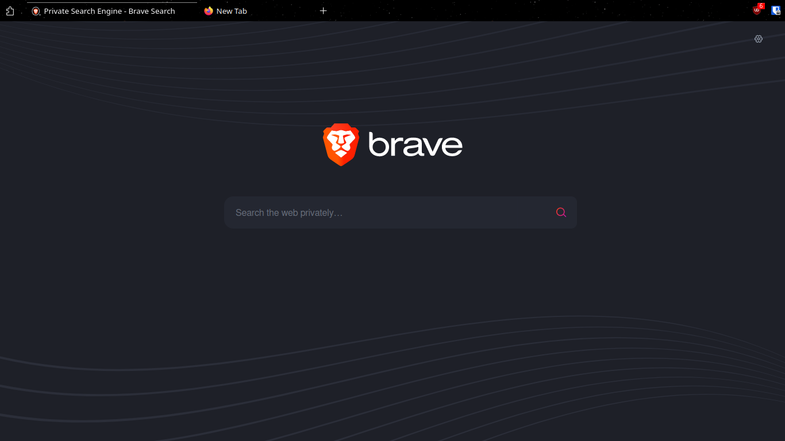
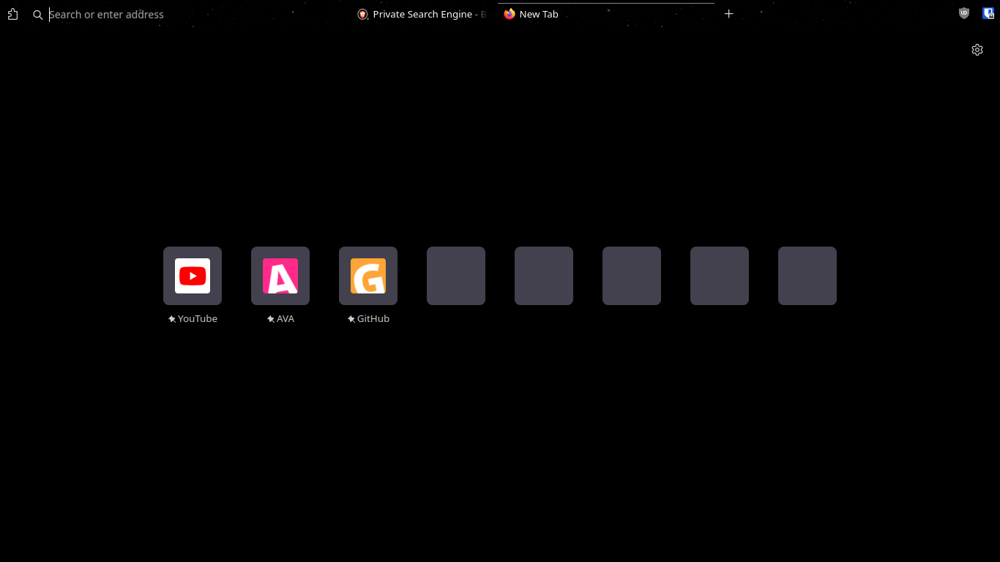

  

# Cascade

**[Cascade](https://github.com/andreasgrafen/cascade), but with hidden non-focused URL and fixed for compact mode.**

 

## What it can look like after a bit of customization

- Customized toolbar + compact mode + [dark space theme](https://addons.mozilla.org/en-US/firefox/addon/nicothin-space/)
- Use `Ctrl + L` to focus url bar on normal browsing

normal browsing

new tab

